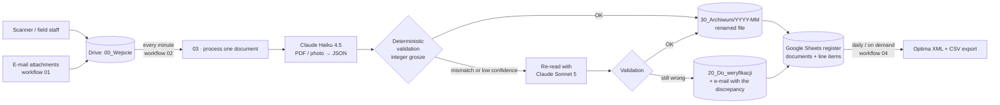
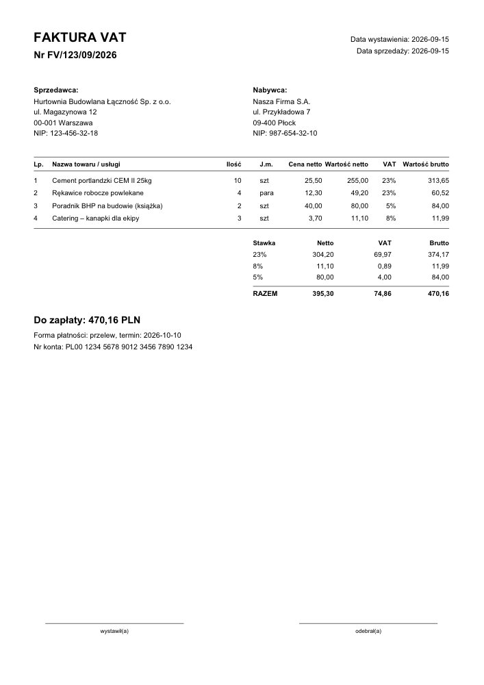
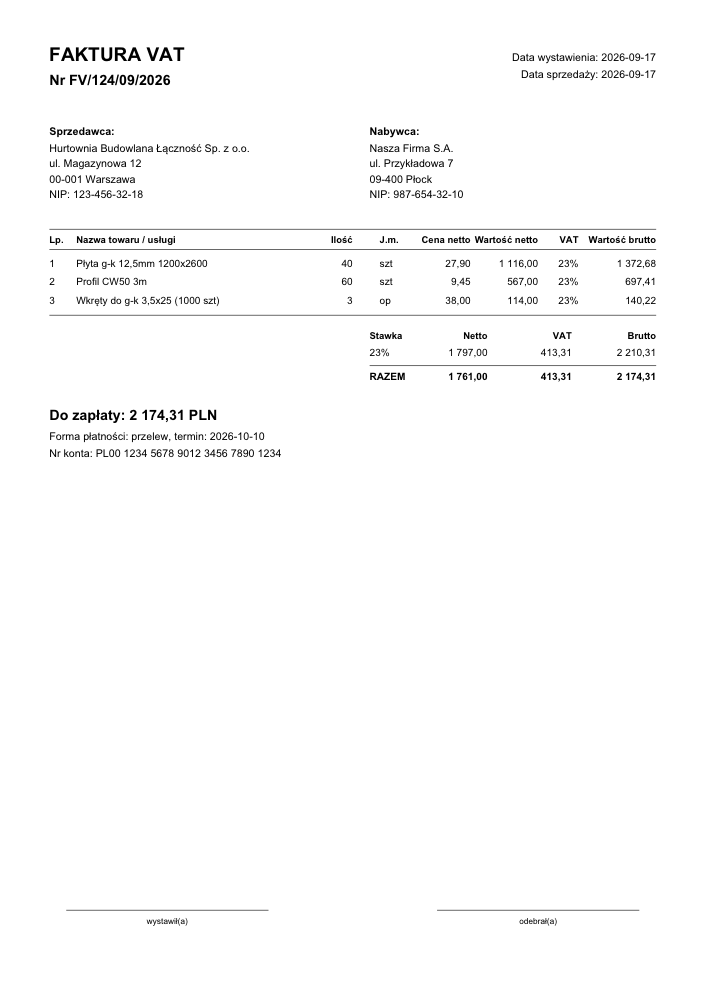
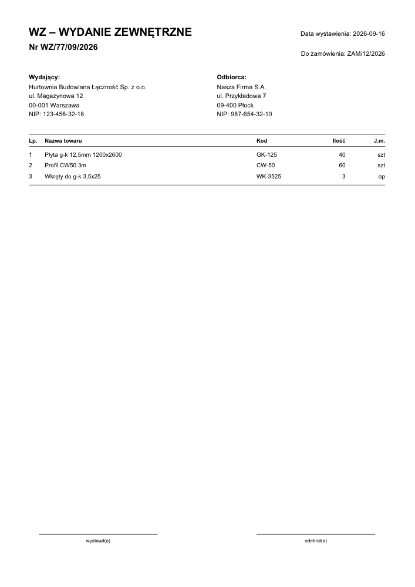
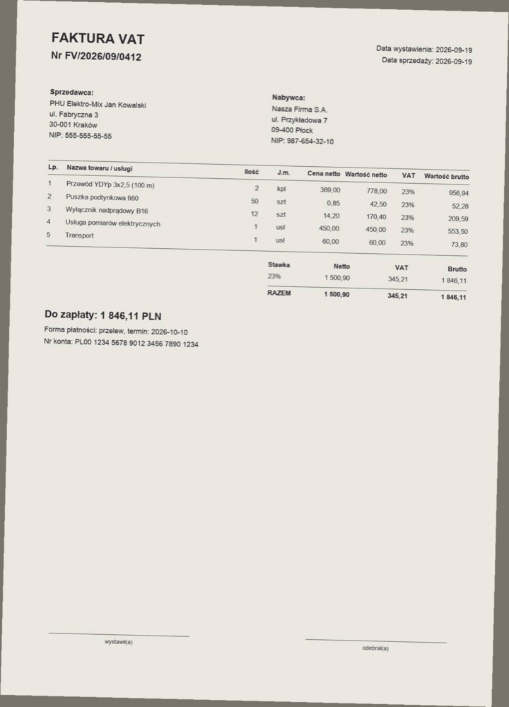

# AI document intake → Comarch Optima (n8n + Claude)

**Automated processing of purchase invoices, delivery notes (WZ) and purchase orders for a Polish SME.**
Documents dropped into a Google Drive folder (scanner, field staff, e-mail attachments) are read by Claude,
**checked arithmetically by deterministic code**, renamed, archived, logged in a Google Sheets register and
exported for import into Comarch ERP Optima. Documents that don't add up go to a review folder with an e-mail
explaining exactly what is wrong.

Self-hosted n8n on a 1 GB VPS — no per-operation fees. AI cost: **≈ $0.008 per document** (Claude Haiku 4.5).

> 🇵🇱 Pełna instrukcja wdrożenia i obsługi po polsku: [docs/INSTRUKCJA.md](docs/INSTRUKCJA.md)

---

## The problem

The accounting team received cost documents from three channels (office scanner, e-mail, employees
photographing paperwork on site) into one Drive folder and re-typed every line item into the ERP by hand —
including checking that the line items actually add up to the document totals.

## What it does



**The AI only transcribes. It never decides whether the numbers are right.** The prompt explicitly forbids
the model from recomputing or "fixing" totals; a separate, unit-tested validator (plain JavaScript, integer
arithmetic in grosze) checks:

- sum of line items = document net total (the core requirement),
- VAT table per rate: line items per rate, VAT = net × rate, net + VAT = gross,
- per line: quantity × unit price = line net, net + VAT = gross,
- Polish tax ID (NIP) checksum, required fields per document type, date formats,
- duplicates (same supplier NIP + document number already in the register),
- warnings that don't block: foreign currency, foreign supplier, invoice issued to another company.

When validation fails with an error that could be a misread, the document is re-read once by a stronger
model (Sonnet 5). Only if it still fails does a human get involved.

## Results from the live deployment

Real runs on the production instance with the sample documents from this repo (not customer data; e-mail texts translated from Polish):

| Document | Model(s) | Cost | Outcome |
|---|---|---|---|
| Invoice, 3 VAT rates | Haiku | $0.009 | archived as `2026-09-15_FV_1234563218_FV-123-09-2026.pdf` |
| Phone photo of an invoice (rotated, noisy) | Haiku | $0.008 | archived |
| Purchase order | Haiku | $0.008 | archived |
| Delivery note (quantities only, no prices) | Haiku | $0.008 | archived (math checks skipped, quantities required) |
| Invoice with wrong net total | Haiku → Sonnet | $0.027 | review + e-mail: *"Line items net 1 797,00 ≠ summary net 1 761,00 (difference 36,00)"* |
| Invoice with invalid supplier NIP | Haiku → Sonnet | $0.027 | review + e-mail: *"Supplier NIP 1234563219 has an invalid checksum"* |

Export: 4 approved documents → Optima XML (2 invoices in the VAT purchase register) + 2 CSV files
(headers, line items); register rows stamped as exported so nothing is exported twice.

Runtime footprint: ~330–490 MB RAM for n8n on a shared 1 GB VPS, ~20 s per document (≈ 50 s with a retry).

## Engineering notes (things that bit, and how they were handled)

- **The model misread hyphenated tax IDs.** Haiku turned a NIP printed as `XXX-XXX-XX-XX` into an 11-digit number (it duplicated a digit next to a dash). The NIP
  checksum caught it and the Sonnet retry fixed it — the safety net worked, but at 3× the cost. Fix: the prompt
  now asks for the NIP *verbatim, character by character, including dashes*; normalization happens in code.
  After the change, every hyphenated NIP was read correctly on the first pass.
- **Structured-output schema limit.** The first live run failed with a 400: the API allows at most 16
  union-typed (nullable) fields in a JSON schema; mine had 36. Text fields now use `""` for "missing"
  (converted to `null` in code), only amounts stay nullable (12 unions). A unit test now guards the limit.
- **n8n sub-workflow error output loses context.** `Execute Workflow` in "each item" mode with an error branch
  dropped the input item and routed errors to an unexpected output index. Replaced with an explicit
  one-file-at-a-time loop and an `error` check, so a failing file is always identifiable and moved to `90_Bledy`.
- **1 GB RAM.** Running the n8n CLI next to the running instance starts a second full n8n process and starved
  SQLite. The deploy script now stops n8n, runs import/validate/publish in a one-off container, and restarts.
- **Small things that only show up in production:** a new Google Sheet has 26 columns (the register needs 33);
  `N8N_PORT` from `.env` leaked into the container and moved n8n's internal port; macOS `tar` shipped `._*`
  files to the server.

## Why n8n (self-hosted) and not Make

One document is ~20 operations → ~10k operations/month at 500 documents, i.e. a paid, volume-priced Make plan.
Self-hosted n8n costs only the VPS. It also let the business logic live in a git repository as ordinary,
tested code (`src/`) that is *injected* into the workflow's Code nodes at build time, instead of being clicked
together in a UI.

## Repository layout

| Path | What's inside |
|---|---|
| `src/extraction.js` | prompt, JSON schema (structured outputs), Claude request builder |
| `src/validate.js` | **deterministic validation** (the heart of the project) |
| `src/filename.js` | file naming scheme (`{data}_{typ}_{nip}_{numer}` …) |
| `src/optima_export.js` | register rows, CSV, Optima XML mapping |
| `scripts/build_workflows.mjs` | generates `workflows/*.json` and injects `src/` into Code nodes |
| `workflows/` | importable n8n workflows (generated) |
| `tests/` | 45 unit tests + an E2E suite that runs the real workflows in n8n with mocked Google/Claude |
| `samples/generate_samples.py` | realistic test documents, incl. deliberately broken ones and a "phone photo" |
| `deploy/deploy_mikrus.sh` | SSH deployment to a small VPS (tests → upload → import → validate → publish) |

Sample documents used in the tests (fictional companies and tax IDs):

| Invoice, 3 VAT rates | Wrong total | Delivery note | Phone photo |
|---|---|---|---|
|  |  |  |  |

## Try it

```bash
npm install && npm test                      # unit tests
docker compose up -d && npm run test:e2e     # real n8n, mocked external services
.venv/bin/python samples/generate_samples.py # sample documents
ANTHROPIC_API_KEY=... npm run try-extraction # real Claude on the samples, same prompt + validation as n8n
```

Full setup (Google OAuth, credentials, Drive folders, VPS deployment, daily operation, Optima import):
[docs/INSTRUKCJA.md](docs/INSTRUKCJA.md) (Polish).

## Status and limitations

- Running in production on a Mikrus 2.1 VPS; e-mail intake (workflow 01) is built and tested but not yet enabled.
- The Optima XML follows the "praca rozproszona" exchange format as a draft — Comarch doesn't publish a full
  schema, so the mapping (one place: `src/optima_export.js`) is meant to be matched against a sample export
  from the target Optima before the first production import.
- Since 2026 Polish domestic invoices are also available via KSeF (the national e-invoicing system), which
  Optima can pull directly; this pipeline is most valuable for delivery notes, orders, foreign invoices and
  paper copies — and as a cross-check (matching delivery notes to KSeF invoices is a natural next step).

## Stack

n8n 2.x (self-hosted, Docker, SQLite) · Claude Haiku 4.5 / Sonnet 5 (Anthropic API, structured outputs) ·
Google Drive & Sheets API · Gmail SMTP/IMAP · Node.js (tests, build) · Python (sample generator) · Mikrus VPS

## License

MIT — see [LICENSE](LICENSE).
